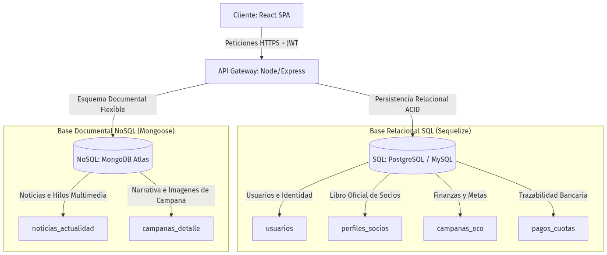

# UNIVERSIDAD TECNOLÓGICA NACIONAL (UTN)
## Extensión Áulica Necochea
### METODOLOGÍA DE SISTEMAS 2

**Trabajo Final Integrador**  
*Portal Web de la Asociación Cooperadora del Hospital Municipal "Dr. Emilio Ferreyra" (Necochea)*

**MIEMBROS DEL EQUIPO Y ROLES:**
* **Thiago Masson:** Full Stack Developer & Branding Specialist
* **Kevin Nielsen:** Security & Backend Developer
* **Aramis Prieto:** Scrum Master & Lead Backend Developer
* **Santiago Ialungo:** UI/UX & Lead Frontend Developer

* **Docente:** Daniel Moreno
* **Fecha de Entrega:** Junio 2026 · Necochea, Argentina

---

### 1. Descripción General del Alcance del Proyecto

El proyecto consiste en el diseño, desarrollo e implementación de un portal web interactivo, robusto y con arquitectura en la nube para la Asociación Cooperadora del Hospital Municipal "Dr. Emilio Ferreyra" de la ciudad de Necochea. El alcance abarca la digitalización de los procesos tradicionales de la institución, reemplazando las planillas de papel por un sistema auditable.

**Requerimientos generales planteados:**
* **Gestión y Autogestión de Socios:** Registro en línea de usuarios, con un panel privado donde cada socio puede completar sus datos obligatorios (DNI único, domicilio, teléfono) para ser incorporado formalmente al Libro Registro de Asociados digital.
* **Módulo Transaccional de Cuotas Sociales:** Historial de pagos mensuales, control de estados de membresía y pasarela de pago recurrente mediante Mercado Pago.
* **Campañas de Recaudación Transparentes:** Visualización pública de campañas de recaudación activas para la compra de insumos médicos o aparatología, provistas de barras de progreso financiero calculadas en tiempo real frente a metas objetivas.
* **Declaración y Auditoría de Donaciones:** Checkout interactivo para registrar transferencias bancarias manuales mediante la carga de comprobantes, y un sistema alternativo de donación directa en línea a través de Mercado Pago.
* **Panel Administrativo:** Interfaz de control exclusiva para operadores que permite aprobar o rechazar transferencias, dar de alta/baja/modificar campañas, y gestionar el estado del padrón de socios.
* **Módulo Informativo de Actualidad:** Portal dinámico de publicación de novedades y logros institucionales.

---

### 2. Miembros del Equipo y Roles Asignados

Para la planificación, desarrollo y optimización del portal web, se definieron roles basados en las fortalezas individuales de los integrantes, asegurando una metodología de trabajo ágil y colaborativa:

* **Aramis Prieto (Scrum Master & Lead Backend Developer):** Responsable de facilitar ceremonias ágiles, orquestar los modelos e interconexión de bases de datos híbridas, controlar la transaccionalidad concurrente mediante bloqueos de fila relacionales y programar la suite de pruebas de integración automatizadas.
* **Kevin Nielsen (Security & Backend Developer):** Encargado de implementar la autenticación segura por JSON Web Tokens (JWT), configurar middlewares de control de tasa de solicitudes (Rate Limiting) por IP, estructurar validaciones mediante expresiones regulares y desarrollar el servicio de correos automatizados SMTP.
* **Santiago Ialungo (UI/UX & Lead Frontend Developer):** Responsable del diseño visual adaptado al entorno de salud (paleta clínica, fondos ECG), maquetación responsiva con Tailwind CSS de las vistas públicas y el panel administrativo, e integración de Lenis scroll y Navbar Scroll-Spy.
* **Thiago Masson (Full Stack Developer & Branding Specialist):** Encargado de la migración y estandarización del monorrepo mediante entornos pnpm, integración de logotipos oficiales de la cooperadora, desarrollo del módulo documental de noticias e implementación de capas de sanitización contra ataques XSS con DOMPurify.

---

### 3. Descripción de la Arquitectura Seleccionada

Se ha optado por una Arquitectura Cliente-Servidor Desacoplada apoyada en una Persistencia Híbrida para responder de manera óptima a las necesidades transaccionales y multimedia del portal.

* **Lenguaje y Entorno:** JavaScript/Ecosystem de extremo a extremo, utilizando Node.js (Express) en el backend y React.js (Vite) en el frontend.
* **Frameworks y Librerías Base:** Sequelize como ORM para la interacción relacional y Mongoose como ODM para el motor documental.
* **Repositorio y Monorrepo:** Alojado en GitHub, orquestado mediante workspaces de pnpm para agilizar la consistencia de dependencias entre el cliente y el servidor.

#### Arquitectura Web / Datos:

1. **Motor Relacional (SQL - PostgreSQL / MySQL):** Resguarda la información con estrictas garantías ACID. Contiene las tablas de usuarios (credenciales con claves hasheadas mediante bcryptjs), perfiles_socios (datos registrales) y campanas_eco (totales financieros y metas de recaudación).
2. **Motor Documental (NoSQL - MongoDB Atlas):** Almacena estructuras dinámicas de formato libre y alta carga multimedia. Contiene las colecciones de noticias_actualidad y campanas_detalle (narrativas enriquecidas, galerías fotográficas y testimonios) vinculadas lógicamente al ID relacional.

3. **Data Mashup:** Para reducir latencias de red, el backend ejecuta consultas en paralelo en ambos motores mediante Promise.all, unificando la respuesta financiera (SQL) y descriptiva (NoSQL) en un solo objeto JSON plano enviado al cliente en una única petición.

---

### 4. Análisis del Estado Actual del Código y Propuestas de Mejora

A continuación, se detalla el estado actual del código y se detectan bloques de oportunidad para incorporar buenas prácticas mediante patrones de diseño más simples y directos.

#### Alto acoplamiento a servicios de terceros y falta de abstracción en pasarelas de pago
* **Módulo / paquete:** `backend/controllers/socioSubscriptionController.js` y `backend/services/mpService.js` (Módulo transaccional de cuotas).
* **Solución a implementar:** Romper el acoplamiento directo introduciendo una capa de abstracción basada en contratos funcionales (simulando interfaces de software). En lugar de que la lógica de suscripciones dependa directamente de los métodos e implementaciones concretas del SDK de Mercado Pago, se propone definir una estructura formal genérica (ej. `IPaymentGateway`) con firmas abstractas como `procesarPagoRecurrente()` o `cancelarSuscripcion()`. De esta forma, el controlador interactúa exclusivamente con el contrato abstracto y no con la implementación rígida del proveedor.
* **Ventajas de la implementación:** Desacoplamiento total de la infraestructura externa. Si en el futuro la Asociación Cooperadora decide migrar de Mercado Pago a otra plataforma transaccional (como Stripe, MODO o webhooks bancarios directos), bastará con codificar un nuevo servicio que respete el contrato de la interfaz, reduciendo a cero las modificaciones sobre los controladores de suscripciones existentes.
* **Posibles desventajas:** Dado que el entorno de ejecución seleccionado es JavaScript nativo (Node.js/Express) y no cuenta con la palabra clave `interface` a nivel de lenguaje como TypeScript, la obligatoriedad del contrato debe ser emulada mediante polimorfismo o validaciones estructurales manuales en tiempo de ejecución, sumando una pequeña capa de abstracción que el equipo debe vigilar estrechamente.

#### Patrón Factory Method (Creacional)
* **Módulo / paquete:** `backend/services/userService.js` (Creación de usuarios).
* **Solución a implementar:** Utilizar una función o clase fábrica que, dado el rol (Socio o Admin), devuelva la instancia correcta del modelo de usuario con sus respectivos permisos precargados.
* **Ventajas de la implementación:** Desacopla la lógica de creación de objetos de los controladores, cumpliendo el principio Open/Closed al poder añadir nuevos tipos de usuario fácilmente.
* **Posibles desventajas:** Puede generar una sobreingeniería si los tipos de usuario son muy estáticos y no requieren procesos de creación distintos.

#### Patrón Singleton (Creacional - Optimización de Recursos)
* **Módulo / paquete:** `backend/config/db.js` (Conexión a las bases de datos PostgreSQL y MongoDB).
* **Solución a implementar:** Implementar el patrón Singleton para asegurar que toda la aplicación comparta y reutilice una única instancia activa de conexión hacia ambos motores de datos, centralizando el ciclo de vida del acceso a datos.
* **Ventajas de la implementación:** Ahorro óptimo de memoria y prevención activa contra la sobrecarga del pool de conexiones del servidor al impedir la instanciación múltiple e innecesaria en entornos concurrentes.
* **Posibles desventajas:** Introduce un estado global en la aplicación, lo que puede incrementar la dificultad al momento de estructurar pruebas unitarias aisladas si no se implementa un manejo correcto de mocks para la conexión.

#### Procesamiento síncrono y bloqueo operativo en la validación de transferencias bancarias
* **Módulo / paquete:** `backend/controllers/donacionController.js` (Módulo de administración y aprobación de comprobantes).
* **Problema detectado:** Actualmente, cuando un donante sube un comprobante de transferencia bancaria, el sistema registra la intención en un estado "pendiente". El impacto real en las métricas de la campaña y la notificación de agradecimiento quedan totalmente congelados hasta que un administrador ingresa manualmente al panel, revisa el homebanking del hospital y presiona el botón "Aprobar". Esto genera un cuello de botella operativo, retrasa la actualización en tiempo real de las barras de recaudación de fondos y degrada la experiencia del usuario, quien no recibe confirmación inmediata de su acto benéfico.
* **Solución a implementar:** Implementar el Patrón State (Estado) combinado con una arquitectura basada en eventos (Worker asíncrono). El controlador de donaciones pasará a delegar el comportamiento del flujo a clases de estado específicas (EstadoPendiente, EstadoAprobado, EstadoRechazado). Adicionalmente, para mitigar la carga manual, se propone diseñar un servicio de conciliación en segundo plano (Cron Job / Worker) que consuma una API simulada de notificaciones bancarias inmediatas (o webhooks interbancarios), permitiendo transicionar el estado de la donación de forma automatizada y asíncrona en el momento en que ingresen los fondos, liberando al administrador de la tarea repetitiva.
* **Ventajas de la implementación:**
  * **Desacoplamiento total:** La lógica de qué pasa cuando una donación se aprueba o se rechaza queda encapsulada en sus respectivas clases de estado, limpiando el controlador.
  * **Eficiencia y UX:** Las barras de progreso de las campañas públicas se actualizan de forma mucho más ágil y el donante recibe su comprobante/mail automatizado sin depender de la disponibilidad horaria del personal administrativo.
* **Posibles desventajas:** Incrementa la complejidad técnica del backend al requerir el manejo de tareas programadas en segundo plano (node-cron o colas de tareas) e introduce lógica adicional para resolver situaciones excepcionales (por ejemplo, transferencias retenidas por el banco o montos mal declarados por el usuario). Sin embargo, es una arquitectura completamente viable y altamente recomendada para sistemas que planean escalar su volumen de transacciones.
