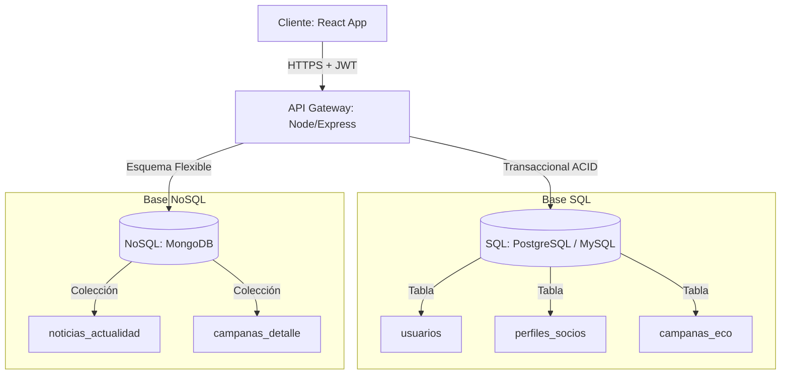

# 🏥 Cooperadora del Hospital Municipal "Dr. Emilio Ferreyra" (Necochea)
### Trabajo Final Integrador (TFI) — Programación IV (Etapa 4)
**Universidad Tecnológica Nacional (UTN) — Extensión Áulica Necochea**

---

## 👥 Integrantes del Grupo
* **Aramis Prieto**
* **Kevin Nielsen**
* **Thiago Masson**
* **Santiago Ialungo**

**Profesor:** Ing. Hernández Gauna, Jorge G.

---

## 📋 Resumen del Proyecto y Etapas

Este proyecto consiste en el diseño e implementación de un portal web integral y seguro para la **Asociación Cooperadora del Hospital Municipal de Necochea**. Su objetivo es digitalizar la captación y administración de socios, visibilizar de forma transparente el destino de las donaciones por medio de campañas de recaudación y publicar novedades institucionales.

### 🔄 Historial de Etapas Desarrolladas:
* **Etapa 1: Investigación y Análisis:** Análisis situacional de la institución, diagnóstico de las necesidades de centralización y digitalización de pagos, estructuración del modelo de navegación y definición del público objetivo (vecinos de Necochea y Quequén).
* **Etapa 2: Diseño de Wireframes:** Creación de maquetas estáticas en HTML que definen la jerarquía visual de la plataforma (Home, Login, Área Restringida y Buscador).
* **Etapa 3: Análisis de Datos y Arquitectura de Backend:** Diseño del esquema híbrido de datos, análisis de alternativas de persistencia (SQL relacional y NoSQL documental) y definición técnica de la comunicación mediante APIs seguras.
* **Etapa 4: Diseño e Implementación de las API y Prototipo (Etapa Final):** Desarrollo del backend y frontend del portal web interactivo con persistencia híbrida, seguridad JWT y rate limiters, panel administrativo, flujo de aprobación de transferencias bancarias, y envío de correos SMTP. Para un desglose de todos los cambios de esta etapa y su evolución cronológica por versión, consulte la sección **[Historial de Cambios](#-historial-de-cambios)**.

---

## 🏗️ Arquitectura Híbrida de Persistencia

Para optimizar el rendimiento y garantizar la consistencia, implementamos una **Arquitectura de Datos Híbrida**:



### 1. Motor Relacional (SQL: PostgreSQL / MySQL)
Resguarda los datos sensibles que exigen trazabilidad estricta y consistencia **ACID**:
* **`usuarios`**: Credenciales de acceso (emails únicos, contraseñas hasheadas con `bcryptjs` y roles `admin` o `socio`).
* **`perfiles_socios`**: Datos obligatorios del Libro Registro de Asociados (DNI únicos, fechas de alta y estado de aprobación).
* **`campanas_eco`**: Control de metas financieras (monto objetivo y monto acumulado real no negativos).

### 2. Motor Documental (NoSQL: MongoDB con Mongoose)
Almacena documentos de formato libre de alta carga multimedia:
* **`noticias_actualidad`**: Publicaciones con galerías fotográficas, videos y tags dinámicos.
* **`campanas_detalle`**: Complemento de narrativa enriquecida para campañas (testimonios, estado de ejecución de obras y arrays de videos/imágenes) vinculados dinámicamente mediante `campana_id_ref`.

### ⚛️ Transacciones ACID y Concurrencia en Donaciones

El endpoint `POST /api/campanas/:id/donar` utiliza una transacción SQL con **bloqueo de fila** (`SELECT ... FOR UPDATE`) para garantizar consistencia bajo carga concurrente:

1. Se abre una transacción Sequelize.
2. Se adquiere un lock exclusivo sobre la fila de la campaña (`lock: transaction.LOCK.UPDATE`).
3. Se actualiza el `monto_actual` y se hace commit.
4. Cualquier otra donación simultánea sobre la misma campaña espera en cola hasta que la transacción anterior libere el lock.

Esto evita la condición de carrera donde dos donaciones simultáneas leen el mismo valor y sobreescriben la suma del otro.

### 🔄 Fusión Sincrónica: Data Mashup
Cuando un usuario ingresa a ver los detalles de una campaña completa (`GET /api/campanas/:id`), el backend utiliza `Promise.all` para ejecutar de manera paralela y sincrónica dos consultas:
1. Una consulta por clave primaria en SQL para obtener las finanzas de `campanas_eco`.
2. Una consulta documental en MongoDB para obtener la narrativa multimedia de `campanas_detalle`.

Ambas respuestas se ensamblan en un único objeto JSON unificado que se envía al cliente, reduciendo la latencia de red y optimizando la carga en el frontend.

---

## 🔐 Seguridad: Gestión de Roles de Administrador

El endpoint público `POST /api/auth/register` **siempre crea usuarios con rol `socio`**. No es posible auto-asignarse el rol `admin` desde el formulario de registro.

Las cuentas de administrador deben crearse **directamente en la base de datos SQL**, ejecutando una sentencia similar a:

```sql
-- 1. Insertar el usuario admin con contraseña hasheada (generar el hash previamente con bcrypt)
INSERT INTO usuarios (email, password_hash, rol)
VALUES ('admin@cooperadora.org', '$2a$10$...hash...', 'admin');
```

> **Nota:** Para generar el `password_hash` se puede usar un script Node.js con `bcryptjs` o una herramienta online de bcrypt. Nunca almacenar contraseñas en texto plano.

---

## 🚀 Despliegue en la Nube (Arquitectura de Producción)

El proyecto está diseñado para ejecutarse en entornos Cloud Native modernos con la siguiente infraestructura:

1. **Frontend (Vercel):** Hospedaje estático global ultrarrápido para la aplicación React (Vite).
2. **Backend (Render):** Web Service de Node.js alojando la API REST de Express.
3. **Base de Datos SQL (Render PostgreSQL):** Almacenamiento transaccional ACID seguro y protegido.
4. **Base de Datos NoSQL (MongoDB Atlas):** Almacenamiento en la nube (AWS/GCP) para esquemas flexibles.

### 🌐 Webhooks de Mercado Pago (Producción)
Con la arquitectura en la nube, **ya no se requiere el uso de túneles locales (Ngrok/Pinggy)**. El backend desplegado en Render proporciona una URL HTTPS nativa y permanente.
Mercado Pago envía las notificaciones POST directamente a la URL de Render (ej: `https://[TU-APP].onrender.com/api/webhooks/mercadopago`), y los proxies de retorno (`back_urls`) redirigen transparentemente al frontend en Vercel.

*   **Contraseña Global de Acceso (Staging/Nube):** `X9$mK2#vLq7@pW4n` *(Se solicita en un recuadro al abrir la web para evitar accesos públicos)*
*(Nota: Las cuentas locales de prueba no han sido provistas en esta versión de producción hasta que se ejecute la inicialización de la base de datos).*
*   **Cuenta de Mercado Pago (El Comprador Sandbox):** Cuando seas redirigido al checkout de MP, debes iniciar sesión con esta cuenta ficticia para simular el pago:
    *   *Usuario:* `TESTUSER7385770550601504283`
    *   *Contraseña:* `5ZPkJK3MJX`
*   **Cuenta del Vendedor (Interna):**
    *   *Usuario:* `TESTUSER6351276384387938890` (Generó el `MP_ACCESS_TOKEN` del `.env`)

---

## 📖 Manual de Operaciones en Producción (Cloud)

### 1. Variables de Entorno Necesarias
Para que el sistema funcione en la nube, es vital configurar correctamente las variables de entorno en los paneles de **Render** (Backend) y **Vercel** (Frontend):

**En Render (Environment):**
* `DATABASE_URL`: URL externa de la base de datos PostgreSQL de Render.
* `MONGODB_URI`: URL de conexión al clúster de MongoDB Atlas.
* `JWT_SECRET`: Llave secreta alfanumérica para generar los tokens de sesión.
* `MP_ACCESS_TOKEN`: Token de Mercado Pago (Sandbox para pruebas, o el de Producción para cobros reales).
* Configuración SMTP (`SMTP_HOST`, `SMTP_USER`, `SMTP_PASS`, etc.) para el envío de correos.

**En Vercel (Environment Variables):**
* `VITE_API_URL`: La URL pública de tu backend en Render (Ej: `https://tu-backend.onrender.com`).
* `VITE_MP_PUBLIC_KEY`: La clave pública de Mercado Pago (Public Key).

### 2. Inicialización de la Base de Datos Remota (Seeding)
La primera vez que se sube el backend a Render, la base de datos PostgreSQL estará vacía. Para crear las tablas, el usuario Administrador y el Socio de prueba, sigue estos pasos:
1. En tu computadora local, edita temporalmente tu `.env` de la carpeta `backend` colocando en `DATABASE_URL` y `MONGODB_URI` los enlaces de tus bases de datos de la nube.
2. Abre la terminal en la carpeta `backend` y ejecuta: `node seed.js`
3. Esto conectará tu PC a los servidores remotos y sembrará la información. *(Atención: Si tu base de datos prohíbe conexiones sin SSL, nuestro código de `db.js` fuerza SSL automáticamente si la URL contiene `render.com`).*

### 3. Eliminar el Bloqueo de Acceso (Ir a Producción Real)
Actualmente, el portal tiene un "candado" (un `prompt` en JavaScript) para evitar que terceros accedan mientras el equipo realiza pruebas cerradas. 
Cuando el hospital decida lanzar la página de forma oficial al público:
1. Abre el archivo `frontend/src/main.jsx`.
2. Borra todo el bloque de código debajo de `// Protección básica para la etapa de desarrollo` que contiene el `prompt()` y el `if (password !== "X9$mK2#vLq7@pW4n")`.
3. Haz un commit y push a GitHub. Vercel actualizará la página automáticamente y quedará abierta a todo el mundo.

### 4. Transición a Mercado Pago (Dinero Real)
Cuando estés listo para dejar de simular pagos:
1. Ve a tu integración en el panel de Mercado Pago y genera tus **Credenciales de Producción**.
2. Reemplaza el `MP_ACCESS_TOKEN` en Render por el de producción.
3. Reemplaza el `VITE_MP_PUBLIC_KEY` en Vercel por el de producción.
4. Reinicia ambos servidores. ¡A partir de ese momento, los cobros irán directo a la cuenta bancaria de la Cooperadora!

## 🛠️ Comandos Git Utilizados (Estructura de Trabajo)
Para mantener un orden profesional en el repositorio, la estructura de ramas se inicia en `develop`:
```bash
# Inicializar repositorio local
git init

# Agregar todos los archivos estructurados (filtrados por .gitignore)
git add .

# Hacer el primer commit
git commit -m "feat: inicializar backend y frontend híbrido para Etapa 4"

# Crear y cambiarse a la rama de desarrollo
git checkout -b develop
```

---

## 📋 Historial de Cambios

### Versión 1.0.0 — Prototipo e APIs de la Etapa 4 (Aramis Prieto)
- **Persistencia Híbrida SQL/NoSQL**:
  - Implementación del motor relacional PostgreSQL (`usuarios`, `perfiles_socios`, `campanas_eco`) para consistencia transaccional y el motor documental MongoDB (`noticias_actualidad`, `campanas_detalle`) para datos estructurados flexibles y multimedia.
  - Creación del mecanismo **Data Mashup** sincrónico mediante `Promise.all` para fusionar y retornar en una sola llamada el estado financiero (SQL) y el contenido enriquecido (NoSQL) de las campañas.
- **Seguridad y Control de Acceso**:
  - Autenticación segura mediante **JSON Web Tokens (JWT)** y hashing de contraseñas con `bcryptjs`.
  - Redirección inteligente post-login: navegación fluida que redirige usuarios anónimos al Login y vuelve de forma transparente a abrir la campaña seleccionada mediante parámetros de URL.
- **Componentes Interactivos del Frontend**:
  - Esqueleto interactivo del cliente desarrollado en React (Vite) + Tailwind CSS.
  - Conexión del Hero a la primera campaña activa con estados de carga (skeletons) y control de estados vacíos.
  - Protección de concurrencia y doble clic en el Panel Administrativo deshabilitando botones de acción de forma dinámica.

### Versión 1.0.1 — Entorno pnpm, Logo Oficial y Noticias (Thiago Masson)
- **Migración a pnpm**:
  - Transición completa del monorrepo al gestor de paquetes `pnpm` para agilizar descargas y garantizar la consistencia en el árbol de dependencias.
- **Branding Institucional**:
  - Incorporación del logotipo oficial de la Asociación Cooperadora del Hospital Municipal "Dr. Emilio Ferreyra".
- **Módulo de Actualidad e Información**:
  - Creación del gestor de noticias dinámico conectado a la colección MongoDB (`noticias_actualidad`).
  - Renderizado HTML enriquecido de artículos sanitizado con **DOMPurify** en el cliente para prevenir inyecciones de código malicioso XSS.

### Versión 1.0.2 — Fusión e Integración en Rama Principal (Aramis Prieto)
- **Consolidación de Producción**:
  - Fusión e integración de los primeros desarrollos estables acumulados de `develop` hacia la rama principal `main` (Pull Request #1) para establecer la línea base funcional del proyecto.

### Versión 1.0.3 — Seguimiento de Tareas (TODO.md) (Aramis Prieto & Thiago Masson)
- **Coordinación de Equipo**:
  - Creación y actualización del archivo de seguimiento [TODO.md](file:///Users/aramisprieto/Documents/cooperadora-hospital1/TODO.md) en la raíz del proyecto para organizar de manera transparente el backlog de tareas pendientes, en curso y finalizadas.
  - Registro de requerimientos prioritarios como la validación de PDFs de etapas previas, límites de donación para campañas completadas, diseño del panel administrativo y selección mensual de campañas de recaudación.

### Versión 1.0.4 — Rediseño Estético Clínico y Scroll-Spy (Santiago Ialungo)
- **Renovación Estética de UI/UX**:
  - Transición de un diseño oscuro de desarrollo a una interfaz moderna, limpia y netamente profesional orientada a la salud.
  - Paleta de color optimizada: base clara en `slate-50`, acentos rojos institucionales (`brand-600`) y verde esmeralda clínico (`accent-600`).
  - Textura visual mediante un patrón lineal que emula una cuadrícula de electrocardiograma (ECG) en el fondo.
- **Navegación e Interacción**:
  - Detección de lectura en Navbar (*Scroll-Spy*) para destacar dinámicamente la sección activa de la vista actual.
  - Integración de Lenis para un scroll inercial suave sin tirones.
  - Rediseño de indicadores financieros, contadores y optimización de gráficos en el Panel Administrativo.

### Versión 1.1.0 — Checkout de Transferencias y Corrección de Scroll (Kevin Nielsen)
- **Donaciones por Transferencia Bancaria**:
  - Creación de la tabla relacional [DonacionTransferencia.js](file:///Users/aramisprieto/Documents/cooperadora-hospital1/backend/models/DonacionTransferencia.js) en PostgreSQL para auditar transferencias declaradas.
  - Implementación de rutas y controladores para la declaración segura de transferencias en `/api/donaciones`.
- **Aprobación Administrativa Manual**:
  - Adición de la sección de transferencias en [AdminPanel.jsx](file:///Users/aramisprieto/Documents/cooperadora-hospital1/frontend/src/views/AdminPanel.jsx) permitiendo a los operadores aprobar o rechazar transacciones manualmente, actualizando en tiempo real la barra de progreso de la campaña correspondiente.
- **Optimización y Limpieza de UI**:
  - Simplificación del modal en [Home.jsx](file:///Users/aramisprieto/Documents/cooperadora-hospital1/frontend/src/views/Home.jsx) ocultando datos multimedia secundarios a fin de incentivar una conversión de donación rápida.
  - Migración del wrapper de Lenis al módulo `@lenis/react`, removiendo comportamientos heredados de [index.css](file:///Users/aramisprieto/Documents/cooperadora-hospital1/frontend/src/index.css) para evitar colisiones.
- **Variables de Entorno**:
  - Parametrización en [docker-compose.yml](file:///Users/aramisprieto/Documents/cooperadora-hospital1/docker-compose.yml) usando variables locales para mayor portabilidad de infraestructura.

### Versión 1.2.0 — Seguridad Backend e Inputs (Kevin Nielsen)
- **Rate Limiting por IP**:
  - Configuración de políticas de control de tasa en [rateLimiter.js](file:///Users/aramisprieto/Documents/cooperadora-hospital1/backend/middleware/rateLimiter.js): 100 peticiones globales cada 15 min, 10 intentos de autenticación cada 15 min, y 5 donaciones por hora.
- **Validación de Datos Entrantes**:
  - Middleware de control en [validators.js](file:///Users/aramisprieto/Documents/cooperadora-hospital1/backend/middleware/validators.js) con reglas estrictas para DNI (longitud y valor), formato de correo electrónico y límites de donación seguros (entre $1 y $10.000.000).
- **Protección contra Inyección NoSQL**:
  - Sanitización automática del cuerpo de solicitudes mediante `express-mongo-sanitize` para remover operadores prohibidos (como `$` y `.`).
- **Navegación Fluida**:
  - Ajuste del helper de desplazamiento con offset negativo de `-80px` para impedir que el Navbar fije tapase el título de la sección de destino.

### Versión 1.2.1 — Registro de Cierre de Sesión (Kevin Nielsen)
- **Auditoría e Historial de Accesos**:
  - Registro de eventos específicos de cierre de sesión (`TEAM_002`) en logs para seguimiento de la sesión del usuario operador en el panel de administración.

### Versión 1.3.0 — Simplificación de Donaciones y Peticiones Directas (Kevin Nielsen)
- **Eliminación de Donación Simulada**:
  - Remoción total del método de pago directo con tarjeta simulada de crédito en frontend y backend para concentrar la contabilidad en transferencias auditables directas.
  - Eliminación de controladores y rutas obsoletas como `POST /api/campanas/:id/donar` en [campanaController.js](file:///Users/aramisprieto/Documents/cooperadora-hospital1/backend/controllers/campanaController.js).
- **Consolidación de Dependencias**:
  - Adición formal de archivos de bloqueo `pnpm-lock.yaml` en las carpetas de frontend y backend para consolidar entornos de ejecución idénticos e impedir desajustes en versiones de paquetes instalados.

### Versión 1.4.0 — Servicio de Correo y Agradecimientos Automatizados (Kevin Nielsen)
- **Integración del Módulo SMTP**:
  - Integración de `nodemailer` en el backend para envío de correos electrónicos.
  - Configuración y parametrización de variables SMTP en el archivo de entorno mediante la actualización de [backend/.env.example](file:///Users/aramisprieto/Documents/cooperadora-hospital1/backend/.env.example).
- **Plantillas HTML de Emails Personalizados**:
  - Creación del servicio en [emailService.js](file:///Users/aramisprieto/Documents/cooperadora-hospital1/backend/services/emailService.js) con soporte de diseño adaptativo y estilizado para enviar un mensaje formal de agradecimiento institucional al socio una vez que el operador aprueba su transferencia en el panel.
- **Desencadenador Transaccional**:
  - Conexión asíncrona en [donacionController.js](file:///Users/aramisprieto/Documents/cooperadora-hospital1/backend/controllers/donacionController.js) para despachar el correo de forma no bloqueante inmediatamente al confirmarse la transacción de la donación.

### Versión 1.5.0 — Límites de Campaña y Suite de Pruebas Automatizadas (Aramis Prieto)
- **Validación del Límite de Recaudación en Campañas**:
  - Implementación de reglas de negocio en [donacionController.js](file:///Users/aramisprieto/Documents/cooperadora-hospital1/backend/controllers/donacionController.js) para evitar sobre-donaciones. Bloquea la declaración e impide la aprobación de transferencias que superen el monto objetivo restante de la campaña.
- **Suite de Pruebas Automatizadas con Vitest y Supertest**:
  - Creación de 47 pruebas de integración en la carpeta `backend/tests/` que cubren todas las API expuestas (Autenticación, Socios, Campañas con Mashup, Noticias y Donaciones/Límites).
  - Configuración de un entorno de bases de datos de test aislado en Postgres (`cooperadora_db_test`) y MongoDB (`cooperadora_nosql_test`) con limpieza automática entre tests a través de [setup.js](file:///Users/aramisprieto/Documents/cooperadora-hospital1/backend/tests/helpers/setup.js).
  - Exclusión de rate limiting en modo test en [rateLimiter.js](file:///Users/aramisprieto/Documents/cooperadora-hospital1/backend/middleware/rateLimiter.js) para evitar bloqueos por solicitudes frecuentes.

### Versión 1.6.0 — Desarrollo del Panel de Socios en el Backend (Thiago Masson)
- **Modelo de Control de Cuotas Sociales**:
  - Creación del modelo relacional [PagoCuota.js](file:///Users/aramisprieto/Documents/cooperadora-hospital1/backend/models/PagoCuota.js) en PostgreSQL para registrar el historial de pago de cuotas mensuales de los asociados (mes, año, monto, estado de pago).
  - Configuración de relaciones y cascada de borrado en [models/index.js](file:///Users/aramisprieto/Documents/cooperadora-hospital1/backend/models/index.js).
- **Nuevas Rutas y Controladores de Autogestión**:
  - Implementación de la ruta `GET /api/socios/mi-perfil/cuotas` para consultar el historial de cuotas sociales del socio autenticado en [socioRoutes.js](file:///Users/aramisprieto/Documents/cooperadora-hospital1/backend/routes/socioRoutes.js) y [socioController.js](file:///Users/aramisprieto/Documents/cooperadora-hospital1/backend/controllers/socioController.js).
  - Implementación de la ruta `GET /api/donaciones/mis-donaciones` en [donacionRoutes.js](file:///Users/aramisprieto/Documents/cooperadora-hospital1/backend/routes/donacionRoutes.js) y su controlador en [donacionController.js](file:///Users/aramisprieto/Documents/cooperadora-hospital1/backend/controllers/donacionController.js) para permitir que los socios consulten las transferencias que declararon históricamente.
- **Actualización de Datos de Prueba y Seeds**:
  - Ajuste en [seed.js](file:///Users/aramisprieto/Documents/cooperadora-hospital1/backend/seed.js) para levantar automáticamente un administrador (`admin@cooperadora.org`) y un socio de prueba (`socio@cooperadora.org`) con su perfil activo e historial de cuotas del año 2026.
- **Verificación Automatizada**:
  - Creación de la suite de pruebas automatizadas [socioPanel.test.js](file:///Users/aramisprieto/Documents/cooperadora-hospital1/backend/tests/socioPanel.test.js) que valida el correcto funcionamiento de los endpoints y los mecanismos de bloqueo de peticiones anónimas (Status 401).

### Versión 1.7.0 — Integración de Mercado Pago y Gestión de Pagos en Panel de Socios (Aramis Prieto)
- **Modelo Ampliado de Socios y Base de Datos**:
  - Ampliación del esquema de [PerfilSocio.js](file:///Users/aramisprieto/Documents/cooperadora-hospital1/backend/models/PerfilSocio.js) en PostgreSQL para registrar información de contacto detallada: `nombre`, `apellido`, `direccion`, `nacionalidad`, `telefono`, `fecha_nacimiento`, `genero`, `metodo_pago` ('transferencia', 'efectivo', 'debito'), `fecha_ultimo_pago`, `localidad` y `observaciones`.
  - Unificación del modelo [PagoCuota.js](file:///Users/aramisprieto/Documents/cooperadora-hospital1/backend/models/PagoCuota.js) para integrar los períodos de facturación (`mes`, `anio`) con el registro de transacciones de pago (`metodo_pago`, `mp_payment_id`, `numero_comprobante`, `comprobante_url`), utilizando `socio_numero_asociado` como clave foránea única.
- **Integración con Mercado Pago para Cuotas Sociales**:
  - Creación del servicio [mpService.js](file:///Users/aramisprieto/Documents/cooperadora-hospital1/backend/services/mpService.js) que se integra con el SDK oficial de Mercado Pago para gestionar suscripciones recurrentes de débito automático.
  - Implementación de webhooks transaccionales en `/api/webhooks/mercadopago` que procesan notificaciones de tipo `preapproval` (suscripción) y `payment` (captura del cobro mensual), actualizando el estado de la membresía y registrando las transacciones en tiempo real.
- **Flujo de Pago y Declaración Manual**:
  - Implementación de endpoints seguros de autogestión en `/api/socios/mi-perfil/pagos/declarar` para que los asociados puedan reportar comprobantes de pago de cuota mediante transferencia bancaria.
  - Creación de rutas de autogestión de suscripción Mercado Pago (`POST /api/socios/suscripcion/crear` y `POST /api/socios/suscripcion/cancelar`).
- **Rediseño Premium del Panel de Socio**:
  - Fusión de las funcionalidades en una interfaz de usuario integrada en [SocioPanel.jsx](file:///Users/aramisprieto/Documents/cooperadora-hospital1/frontend/src/views/SocioPanel.jsx) dividida en pestañas estéticas y responsivas:
    - **Mi Resumen**: Permite visualizar la ficha del asociado y actualizar sus datos de contacto y DNI.
    - **Mis Cuotas**: Integra el historial de períodos mensuales con el historial transaccional de pagos, y ofrece un selector dinámico para pagar a través de débito automático de Mercado Pago, registrar manualmente una transferencia o ver información del cobrador domiciliario.
    - **Mis Donaciones**: Muestra el registro histórico de aportes hechos a las campañas del hospital.
- **Pruebas de Integración y Verificación**:
  - Creación de la suite de pruebas [socioSubscription.test.js](file:///Users/aramisprieto/Documents/cooperadora-hospital1/backend/tests/socioSubscription.test.js) que verifica la creación de suscripciones, cancelación, declaraciones manuales y callbacks asíncronos del webhook.

### Versión 1.8.0 — Control de Método de Pago y Donaciones con Mercado Pago (Grupo Cooperadora)
- **Control de Cambios de Método de Pago**:
  - Adición de las columnas `cant_cambios_metodo_pago` y `mes_ultimo_cambio_metodo_pago` en `PerfilSocio.js`.
  - Implementación de validaciones a nivel de backend en `socioController.js` para limitar las actualizaciones de método de pago a un máximo de 3 por mes para los socios. Los administradores están exentos de esta restricción.
  - Inclusión de diálogos de confirmación del navegador (`window.confirm`) en el panel de socios de `SocioPanel.jsx` antes de actualizar el medio de pago, capturando y desplegando adecuadamente los errores de validación HTTP 400.
- **Donaciones en Línea para Campañas**:
  - Integración del botón y pestaña de pago online con **Mercado Pago** en el modal de detalles de campañas en `Home.jsx`, incluyendo redirecciones seguras y alertas globales de éxito o fallo (`donation_success`/`donation_failure`).
  - Creación del endpoint `POST /api/donaciones/campanas/:id/donar-mp` y su correspondiente controlador en `donacionController.js` para generar preferencias de pago seguro.
  - Ampliación del webhook de Mercado Pago en `socioSubscriptionController.js` para detectar transacciones con formato de referencia externa `donation_u{userId}_c{campanaId}`, registrar aportes confirmados, actualizar de forma segura y concurrente el monto acumulado de la campaña con bloqueo de fila (`LOCK.UPDATE`), y despachar correos electrónicos SMTP de agradecimiento.
- **Robustez de Entorno y Pruebas**:
  - Incorporación de 6 nuevas pruebas de integración automatizadas en las suites `socio.test.js` and `donacion.test.js`, elevando a 79 el total de casos exitosos.
  - Configuración de la directiva `server.allowedHosts: true` en `vite.config.js` para facilitar el testeo remoto y compatibilidad con túneles HTTPS de desarrollo.

### Versión 1.9.0 — Túneles Dinámicos y Proxy de Retorno Seguro para Mercado Pago (Aramis Prieto)
- **Automatización de Túneles Locales**:
  - Creación del script avanzado de inicialización `start-dev-with-tunnel.js` para levantar ngrok o túneles SSH de Pinggy de manera dinámica.
  - Auto-inyección de la variable de entorno `BACKEND_TUNNEL_URL` en ejecución para habilitar el enrutamiento bidireccional instantáneo de Webhooks en local.
- **Bypass de Restricciones HTTPS (Return Proxy)**:
  - Implementación de controladores públicos (`handleMpRedirect` y `handleSocioMpRedirect`) que actúan como pasarelas de retorno HTTP 302 seguras.
  - Esto soluciona de raíz el error 400 Bad Request devuelto por las APIs de Preferences y PreApproval de MP, las cuales rechazan estrictamente cualquier URL de retorno que comience con `http://` (como los entornos `localhost`). El flujo ahora dirige al usuario al túnel `https://` y este lo rebota limpiamente a su navegador local reteniendo los parámetros de estado de pago.
- **Configuración de Semillas (Seed)**:
  - Actualización del usuario semilla de pruebas a `test_user_7385770550601504283@testuser.com` para alinear el ecosistema local y la base de datos de PostgreSQL con el Sandbox del usuario Comprador asignado en Mercado Pago.

### Versión 1.10.0 — Auditoría de Seguridad y Despliegue en Nube (Etapa Final)
- **Hardening de Seguridad (Mitigación OWASP)**:
  - **Spoofing y Webhooks**: Implementación de verificación criptográfica (HMAC SHA256) de la cabecera `x-signature` en los webhooks de Mercado Pago para prevenir falsificación de pagos.
  - **CORS Estricto**: Restricción de orígenes permitidos en la API para aceptar peticiones únicamente del frontend local (`localhost:5173`, `3000`) y del dominio de producción provisto por Vercel.
  - **Sanitización y SSRF**: Inclusión de cabeceras de seguridad HTTP globales mediante `Helmet` y validación estricta de formato de URLs en la subida de comprobantes de pago.
  - **Políticas de Contraseña y Enumeración**: Refuerzo de la expresión regular de contraseñas (mínimo 8 caracteres, alfanumérico con mayúsculas) y ofuscación de respuestas en el registro para evitar ataques de enumeración de usuarios.
- **Preparación para Producción Privada (Staging)**:
  - Bloqueo por contraseña de acceso directo en el punto de entrada de React (`main.jsx`) para mantener la confidencialidad de la plataforma durante las pruebas en equipo.
  - El proyecto está ahora preparado para ser hosteado bajo la arquitectura Serverless gratuita: **MongoDB Atlas** (Base de datos), **Render.com** (Node.js API) y **Vercel** (Frontend estático React).

### Versión 1.11.0 — Parches de Seguridad Críticos, Optimización y Accesibilidad (Aramis Prieto)
- **Seguridad Crítica (Fail-Closed en Webhooks)**:
  - Modificación de la verificación de firmas criptográficas de Mercado Pago en [socioSubscriptionController.js](file:///Users/aramisprieto/Documents/cooperadora-hospital1/backend/controllers/socioSubscriptionController.js) para forzar un esquema fail-closed. El servidor ahora detiene el procesamiento en producción si falta la variable de entorno `MP_WEBHOOK_SECRET`.
- **Prevención de Replay Attacks**:
  - Implementación de validación de antigüedad de timestamp (`ts`) en las firmas de webhook de Mercado Pago, rechazando peticiones que excedan una tolerancia horaria de 5 minutos.
- **Transaccionalidad en Inserción de Campañas y Registro**:
  - Envolvimos la creación en PostgreSQL y MongoDB dentro de transacciones Sequelize en [campanaController.js](file:///Users/aramisprieto/Documents/cooperadora-hospital1/backend/controllers/campanaController.js) y [authController.js](file:///Users/aramisprieto/Documents/cooperadora-hospital1/backend/controllers/authController.js). Si ocurre un fallo en MongoDB o perfiles, la transacción se deshace (`rollback`) previniendo datos huérfanos.
- **Rendimiento y Code Splitting**:
  - Aplicación de importación perezosa (`React.lazy` y `<Suspense>`) en [App.jsx](file:///Users/aramisprieto/Documents/cooperadora-hospital1/frontend/src/App.jsx) para los paneles de administración y socio, disminuyendo significativamente la carga del bundle JavaScript inicial.
  - Implementación de paginación (`limit` y `page`) en los listados de noticias y campañas para evitar sobrecarga en la base de datos y la red.
- **Eliminación de Adaptadores Redundantes**:
  - Desinstalación completa de `mysql2` en el backend para aligerar las dependencias en producción.
- **Robustez en Rutas Portables y Mensajes**:
  - Corrección de la ruta absoluta local en [check-users.js](file:///Users/aramisprieto/Documents/cooperadora-hospital1/backend/check-users.js) por resoluciones dinámicas portables con ESM path.
  - Sincronización de log de contraseñas de desarrollo de `socio123` a `SocioCoop2026!` en [update-email.js](file:///Users/aramisprieto/Documents/cooperadora-hospital1/backend/update-email.js) para evitar confusiones de desarrollo.
- **Accesibilidad y SEO**:
  - Adición de `aria-label` descriptivos en [CampaignCard.jsx](file:///Users/aramisprieto/Documents/cooperadora-hospital1/frontend/src/components/CampaignCard.jsx) y etiquetas meta Open Graph en [index.html](file:///Users/aramisprieto/Documents/cooperadora-hospital1/frontend/index.html).
- **Seguridad y Mitigación de ReDoS (Denegación de Servicio)**:
  - Sanitización y escape de caracteres especiales de expresiones regulares en las búsquedas en [noticiaController.js](file:///Users/aramisprieto/Documents/cooperadora-hospital1/backend/controllers/noticiaController.js) para prevenir ataques de Catastrophic Backtracking.
- **Robustez en Webhooks de Mercado Pago**:
  - Fortalecimiento de la verificación de firmas criptográficas para fallar de forma segura si no se ha configurado la variable de entorno `MP_WEBHOOK_SECRET` y no está explícitamente activada la bandera de bypass para testing local.
- **Garantías de Consistencia y Transacciones Distribuidas**:
  - Implementación de transacciones de Sequelize en la edición y borrado de campañas en [campanaController.js](file:///Users/aramisprieto/Documents/cooperadora-hospital1/backend/controllers/campanaController.js) para asegurar la consistencia y reversión eventual entre PostgreSQL y MongoDB Atlas.
- **Paginación y Optimización de Listados**:
  - Paginación y búsqueda optimizada de socios en [socioController.js](file:///Users/aramisprieto/Documents/cooperadora-hospital1/backend/controllers/socioController.js) con soporte de retrocompatibilidad.
- **Indexación y Optimización de Base de Datos**:
  - Creación de índices en [PerfilSocio.js](file:///Users/aramisprieto/Documents/cooperadora-hospital1/backend/models/PerfilSocio.js) y [PagoCuota.js](file:///Users/aramisprieto/Documents/cooperadora-hospital1/backend/models/PagoCuota.js) para optimizar búsquedas por clave y filtrado de periodos.
- **Navegación e Interacción UX (Lenis)**:
  - Adición de `data-lenis-prevent` en el modal flotante de detalles de la campaña en [Home.jsx](file:///Users/aramisprieto/Documents/cooperadora-hospital1/frontend/src/views/Home.jsx) para solucionar fugas de desplazamiento.
- **Configuración de Despliegue Cross-Origin (Vercel + Render)**:
  - Configuración de la URL de la API en [axios.js](file:///Users/aramisprieto/Documents/cooperadora-hospital1/frontend/src/api/axios.js) de forma dinámica utilizando `VITE_API_URL` para evitar errores 404 en producción.
  - Ajuste de cookies HttpOnly en [authController.js](file:///Users/aramisprieto/Documents/cooperadora-hospital1/backend/controllers/authController.js) en producción, cambiando a `sameSite: 'none'` y `secure: true` para habilitar la compartición de sesiones entre dominios cruzados.
- **Resolución de Errores de Construcción (Vite/Rollup)**:
  - Eliminación de la importación y validación de `prop-types` en [CampaignCard.jsx](file:///Users/aramisprieto/Documents/cooperadora-hospital1/frontend/src/components/CampaignCard.jsx), solucionando el error de resolución de módulos y permitiendo compilar el bundle estático en Vercel de forma exitosa.
- **Optimización de Pintura y Rendimiento de Scroll**:
  - Reemplazo del comportamiento `background-attachment: fixed` sobre el body en [index.css](file:///Users/aramisprieto/Documents/cooperadora-hospital1/frontend/src/index.css) por un pseudo-elemento fijo en el viewport. Esto elimina la rasterización repetitiva durante el desplazamiento y soluciona el lag visual al hacer scroll.

### Versión 1.12.0 — Estabilidad de Producción y Datos de Prueba Avanzados (Aramis Prieto)
- **Resolución de SPA Routing en Vercel**:
  - Implementación del archivo de configuración `vercel.json` con reglas de reescritura (`rewrites`) globales hacia `index.html`. Esto previene de forma definitiva el error `404 NOT_FOUND` nativo de Vercel al recargar sub-rutas protegidas de la aplicación React.
- **Tolerancia a Entornos de Preview (CORS)**:
  - Modificación de los orígenes permitidos (CORS) en el backend de Render para aceptar peticiones provenientes de dominios dinámicos de Vercel (`*.vercel.app`), garantizando que cualquier Preview Deployment funcione en perfecta integración con la base de datos de producción sin ser bloqueado.
- **Inyección de Datos (Seed) Avanzada**:
  - Refactorización de `seed.js` para automatizar la creación de una base de datos de prueba rica y realista en la nube.
  - Inclusión de 5 campañas con diversos estados financieros y 4 noticias con testimonios e imágenes reales.
  - Ampliación del padrón con 6 socios de prueba interactivos (activos y pendientes) y generación del usuario Sandbox oficial de Mercado Pago para ensayos financieros.

### Versión 1.13.0 — Refactorización, Optimización de Caché y Estabilidad en Pruebas (Aramis Prieto)
- **Limpieza de Archivos de Bloqueo Redundantes**:
  - Eliminación completa de `package-lock.json` en frontend y backend para delegar de forma exclusiva la gestión de dependencias a `pnpm` y prevenir inconsistencias de dependencias.
- **Optimización de Serialización en Caché (Mashup)**:
  - Conversión a objeto plano de los detalles NoSQL mediante `.toObject()` en el controlador de campañas antes de estructurar el JSON. Esto previene errores en tiempo de ejecución (`TypeError`) al intentar clonar estructuras complejas de Mongoose en la caché.
- **Robustez en Transacciones y Rollbacks**:
  - Corrección de la doble llamada a `transaction.rollback()` en el servicio de registro al rechazar DNI duplicados, garantizando códigos de respuesta HTTP 400 y eliminando falsos positivos de errores internos 500.
- **Estabilidad de la Suite de Tests**:
  - Actualización de los tests de autenticación para comprobar la inyección del token JWT en cabeceras a través de cookies `HttpOnly` (`set-cookie`) en lugar de buscar la propiedad en el cuerpo de la respuesta JSON.
  - Sincronización de credenciales de prueba con las directivas de contraseñas robustas (mayúsculas y números obligatorios).
  - Inclusión de 2 nuevos tests en `auth.test.js` para validar el rechazo de contraseñas que violan el formato seguro (sin mayúsculas o sin números).
  - Integración de `BYPASS_WEBHOOK_SIGNATURE` para posibilitar flujos de pruebas de webhook locales sin requerir firmas válidas de producción.
- **Remoción de Importaciones Inactivas**:
  - Limpieza de importaciones inactivas de `donationLimiter` y `validateDonation` en las rutas de campañas.

### Versión 1.14.0 — Proxies de Producción, Sincronización de Sesión e Invalidación de Caché (Aramis Prieto)
- **Proxy Inverso en Vercel para Cookies Same-Origin**:
  - Configuración de reglas de reescritura (`rewrites`) en [vercel.json](file:///Users/aramisprieto/Documents/cooperadora-hospital1/frontend/vercel.json) redirigiendo `/api/*` hacia el servidor backend de Render. Esto permite tratar las cookies de sesión `HttpOnly` como cookies de primer origen (*Same-Site*), eludiendo de raíz las restricciones de navegadores modernos que bloquean cookies de terceros cruzadas (`*.vercel.app` a `*.onrender.com`).
- **Invalidación Proactiva de Caché en Campañas**:
  - Implementación del helper `flushCache` en [cacheMiddleware.js](file:///Users/aramisprieto/Documents/cooperadora-hospital1/backend/middleware/cacheMiddleware.js) para vaciar completamente la caché en memoria al realizar operaciones de escritura.
  - Vinculación del vaciado de caché en el controlador de campañas ([campanaController.js](file:///Users/aramisprieto/Documents/cooperadora-hospital1/backend/controllers/campanaController.js)), aprobaciones de transferencias ([donacionController.js](file:///Users/aramisprieto/Documents/cooperadora-hospital1/backend/controllers/donacionController.js)) y pagos procesados por Webhook de Mercado Pago ([socioSubscriptionController.js](file:///Users/aramisprieto/Documents/cooperadora-hospital1/backend/controllers/socioSubscriptionController.js)). Esto asegura que la barra de progreso de recaudación y los totales acumulados en la Home pública se actualicen de forma instantánea al ingresar una donación.
- **Resolución de IP Detrás de Proxies en Backend**:
  - Activación de `app.set('trust proxy', 1)` en [index.js](file:///Users/aramisprieto/Documents/cooperadora-hospital1/backend/index.js) de Express. Permite que el middleware de control de tasa (*Rate Limiter*) lea la IP real del cliente en lugar de la IP de los balanceadores de carga de Render o Vercel.
- **Rutas y Webhooks Dinámicos en Mercado Pago**:
  - Refactorización de [mpService.js](file:///Users/aramisprieto/Documents/cooperadora-hospital1/backend/services/mpService.js) introduciendo una función auxiliar `getBackendUrl()`. Resuelve de manera jerárquica la variable de entorno `BACKEND_URL`, el túnel dinámico `BACKEND_TUNNEL_URL`, o recurre al puerto local `5001`. Esto flexibiliza el redireccionamiento y notificaciones webhook en diferentes entornos (local, túneles, y producción).
- **Sincronización Dinámica de Sesión en Navbar**:
  - Adición de `location.pathname` como dependencia al efecto de sesión de [Navbar.jsx](file:///Users/aramisprieto/Documents/cooperadora-hospital1/frontend/src/components/Navbar.jsx) para re-evaluar e impactar instantáneamente el estado del Navbar cuando el usuario navega entre las diferentes vistas de la plataforma.

### Versión 1.15.0 — Consolidación Cloud-Only, Corrección de Redirecciones e Integraciones (Aramis Prieto)
- **Desmantelamiento de Infraestructura Local**:
  - Eliminación del archivo de configuración `docker-compose.yml` de la raíz del proyecto para descartar la instanciación de servicios locales de bases de datos.
  - Purga de las secciones sobre despliegue y flujos de pruebas paso a paso en entornos locales (Localhost) del [README.md](file:///Users/aramisprieto/Documents/cooperadora-hospital1/README.md).
- **Corrección de Redirecciones en Navegación Anónima (Invitado)**:
  - Solución al error que redirigía forzosamente a los usuarios no autenticados hacia `/login?expired=true` al ingresar a páginas públicas. Se optimizó el interceptor de Axios en [axios.js](file:///Users/aramisprieto/Documents/cooperadora-hospital1/frontend/src/api/axios.js) para ignorar respuestas de estado 401/403 originadas por el chequeo de sesión del Navbar (`/auth/me`), posibilitando la navegación anónima como invitado en la página de inicio.
- **Portabilidad de Desarrollo y Producción**:
  - Ajuste de compatibilidad para soportar entornos híbridos donde se requiera probar localmente el frontend/backend o usar webhooks con firmas bypass y orígenes CORS locales, mientras que en producción se mantiene la validación estricta y segura.
