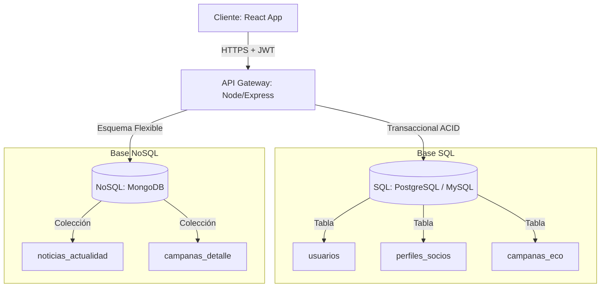
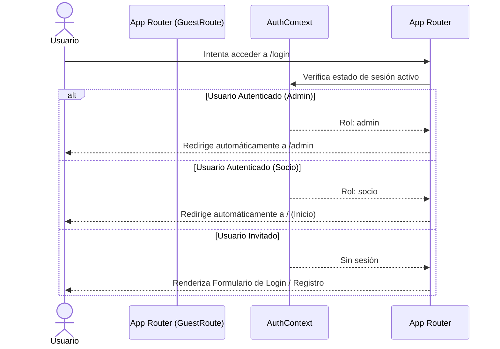
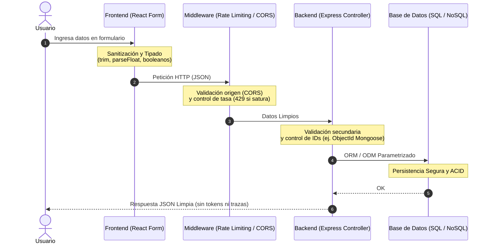

# 🏥 Cooperadora del Hospital Municipal "Dr. Emilio Ferreyra" (Necochea)
### Trabajo Final Integrador (TFI) — Programación IV (Etapa 4)
**Universidad Tecnológica Nacional (UTN) — Extensión Áulica Necochea**

---

## 👥 Integrantes del Grupo
* **Aramis Prieto**
* **Kevin Nielsen**
* **Thiago Masson**
* **Santiago Ialungo**

**Profesor:** Ing. Hernández Gauna, Jorge.

---

## 📋 Resumen del Proyecto y Etapas

Este proyecto consiste en el diseño e implementación de un portal web integral y seguro para la **Asociación Cooperadora del Hospital Municipal de Necochea**. Su objetivo es digitalizar la captación y administración de socios, visibilizar de forma transparente el destino de las donaciones por medio de campañas de recaudación y publicar novedades institucionales.

### 🔄 Historial de Etapas Desarrolladas:
* **Etapa 1: Investigación y Análisis:** Análisis situacional de la institución, diagnóstico de las necesidades de centralización y digitalización de pagos, estructuración del modelo de navegación y definición del público objetivo (vecinos de Necochea y Quequén).
* **Etapa 2: Diseño de Wireframes:** Creación de maquetas estáticas en HTML que definen la jerarquía visual de la plataforma (Home, Login, Área Restringida y Buscador).
* **Etapa 3: Análisis de Datos y Arquitectura de Backend:** Diseño del esquema híbrido de datos, análisis de alternativas de persistencia (SQL relacional y NoSQL documental) y definición técnica de la comunicación mediante APIs seguras.
* **Etapa 4: Diseño e Implementación de las API y Prototipo (Etapa Final):** Desarrollo del backend y frontend del portal web interactivo con persistencia híbrida, seguridad JWT y rate limiters, panel administrativo, flujo de aprobación de transferencias bancarias, y envío de correos SMTP. Para un desglose de todos los cambios de esta etapa y su evolución cronológica por versión, consulte la sección **[Historial de Cambios](#-historial-de-cambios)**.

---

## 📂 Estructura del Proyecto

```text
cooperadora-hospital1/
├── frontend/                 # Aplicación cliente (React + Vite)
│   ├── src/
│   │   ├── api/              # Configuración y llamadas a Axios
│   │   ├── components/       # Componentes reutilizables (UI, Skeletons)
│   │   └── views/            # Vistas principales (Home, ObrasConcretadas, etc.)
│   ├── tailwind.config.js    # Configuración de estilos utilitarios
│   └── vercel.json           # Reglas de proxy inverso para producción
└── backend/                  # Servidor API REST (Node.js + Express)
    ├── config/               # Configuraciones de entorno y base de datos
    ├── controllers/          # Lógica de negocio (Capa de Control)
    ├── middleware/           # Rate limiting, validaciones, caché y autenticación
    ├── models/               # Modelos SQL (Sequelize) y NoSQL (Mongoose)
    ├── routes/               # Definición de endpoints de la API
    └── tests/                # Pruebas automatizadas de integración con Vitest
```

---

## 🏗️ Arquitectura Híbrida de Persistencia

Para optimizar el rendimiento y garantizar la consistencia, implementamos una **Arquitectura de Datos Híbrida**:



### 1. Motor Relacional (SQL: PostgreSQL / MySQL)
Resguarda los datos sensibles que exigen trazabilidad estricta y consistencia **ACID**:
* **`usuarios`**: Credenciales de acceso (emails únicos, contraseñas hasheadas con `bcryptjs` y roles `admin` o `socio`).
* **`perfiles_socios`**: Datos obligatorios del Libro Registro de Asociados (DNI únicos, fechas de alta y estado de aprobación).
* **`campanas_eco`**: Control de metas financieras (monto objetivo y monto acumulado real no negativos).

### 2. Motor Documental (NoSQL: MongoDB con Mongoose)
Almacena documentos de formato libre de alta carga multimedia:
* **`noticias_actualidad`**: Publicaciones con galerías fotográficas, videos y tags dinámicos.
* **`campanas_detalle`**: Complemento de narrativa enriquecida para campañas (testimonios, estado de ejecución de obras y arrays de videos/imágenes) vinculados dinámicamente mediante `campana_id_ref`.

### ⚛️ Transacciones ACID y Concurrencia en Donaciones

El endpoint `POST /api/campanas/:id/donar` utiliza una transacción SQL con **bloqueo de fila** (`SELECT ... FOR UPDATE`) para garantizar consistencia bajo carga concurrente:

1. Se abre una transacción Sequelize.
2. Se adquiere un lock exclusivo sobre la fila de la campaña (`lock: transaction.LOCK.UPDATE`).
3. Se actualiza el `monto_actual` y se hace commit.
4. Cualquier otra donación simultánea sobre la misma campaña espera en cola hasta que la transacción anterior libere el lock.

Esto evita la condición de carrera donde dos donaciones simultáneas leen el mismo valor y sobreescriben la suma del otro.

### 🔄 Fusión Sincrónica: Data Mashup
Cuando un usuario ingresa a ver los detalles de una campaña completa (`GET /api/campanas/:id`), el backend utiliza `Promise.all` para ejecutar de manera paralela y sincrónica dos consultas:
1. Una consulta por clave primaria en SQL para obtener las finanzas de `campanas_eco`.
2. Una consulta documental en MongoDB para obtener la narrativa multimedia de `campanas_detalle`.

Ambas respuestas se ensamblan en un único objeto JSON unificado que se envía al cliente, reduciendo la latencia de red y optimizando la carga en el frontend.

---

## 🔐 Seguridad: Gestión de Roles de Administrador

El endpoint público `POST /api/auth/register` **siempre crea usuarios con rol `socio`**. No es posible auto-asignarse el rol `admin` desde el formulario de registro.

Las cuentas de administrador deben crearse **directamente en la base de datos SQL**, ejecutando una sentencia similar a:

```sql
-- 1. Insertar el usuario admin con contraseña hasheada (generar el hash previamente con bcrypt)
INSERT INTO usuarios (email, password_hash, rol)
VALUES ('admin@cooperadora.org', '$2a$10$...hash...', 'admin');
```

> **Nota:** Para generar el `password_hash` se puede usar un script Node.js con `bcryptjs` o una herramienta online de bcrypt. Nunca almacenar contraseñas en texto plano.

### 🔄 Flujo de Redirección Automática (GuestRoute)
El frontend implementa una lógica inteligente basada en el estado de autenticación (JWT) para evitar que usuarios ya logueados puedan acceder accidentalmente a las pantallas de registro o ingreso.



---

## 🛡️ Estandarización de Seguridad, Robustez y Control de Flujo

Para mitigar riesgos de inyección de código, denegación de servicio (DoS) e interceptación de datos, establecimos políticas estrictas de validación y límites en toda la arquitectura:

### 1. Políticas de Validación y Sanitización de Datos
* **Frontend**: En el evento `onSubmit` de cada formulario (`CampaignForm`, `NewsForm`, `PartnerForm`, `SocioProfile` y `CuotasTab`), los datos de texto son sanitizados mediante `.trim()` para eliminar espacios redundantes. Los montos económicos son parseados estrictamente como números reales (`parseFloat`) y los campos de ID y DNI como enteros (`parseInt`), evitando propagar valores `NaN`.
* **Backend**:
  * Se implementaron validaciones secundarias del formato de parámetros de ruta (`id`). En PostgreSQL/MySQL se comprueba que sean enteros válidos y en MongoDB (Mongoose) se verifica mediante expresiones regulares que cumplan con la estructura de un `ObjectId` hexadecimal de 24 caracteres antes de ejecutar cualquier consulta, evitando caídas internas del driver de base de datos.
  * **Estandarización de Excepciones**: Los bloques `catch` de los controladores se diseñaron de manera hermética. Las trazas técnicas del error (`error.stack` o `error.message`) se imprimen únicamente en el servidor mediante `console.error` para auditoría interna, mientras que al cliente se le retorna siempre una respuesta JSON genérica, evitando la fuga de detalles de estructura de base de datos.

### 2. Control de Flujo y Límite de Tasa de Solicitudes (Rate Limiting)
Se implementaron middlewares basados en `express-rate-limit` en endpoints estratégicos del backend:
* **Global**: `globalLimiter` (100 requests por IP cada 15 minutos) a nivel de API global.
* **Autenticación**: `authLimiter` (10 requests por IP cada 15 minutos) en las rutas de registro y login.
* **Donaciones**: `donationLimiter` (5 requests por IP cada hora) en los endpoints para declarar donaciones por transferencia y Mercado Pago.
* **Transacciones**: `transactionLimiter` (5 requests por IP cada 15 minutos) aplicado en las acciones de los socios como declarar pagos manuales de cuotas y crear suscripciones recurrentes.

### 3. Aislamiento de Dominios (CORS) y Cabeceras HTTP
* **CORS Condicional**: En entornos de producción (`NODE_ENV === 'production'`), el servidor Express restringe las peticiones únicamente a los orígenes explícitos configurados (`FRONTEND_URL`), rechazando peticiones sin cabecera de origen o comodines generales de subdominios de Vercel.
* **Hiding Server Tech & Clickjacking**: Se deshabilita explícitamente la cabecera `X-Powered-By` en Express y se configura `frameguard: { action: 'sameorigin' }` en Helmet para mitigar ataques de secuestro de clics (Clickjacking).

### 4. Optimización y Caché Selectiva
Para garantizar un rendimiento óptimo sin mostrar datos obsoletos (como el progreso de recaudación o novedades recientes), el servidor implementa un sistema de caché en memoria con invalidación selectiva (`flushCachePattern`). Al registrarse una nueva donación o editarse una noticia, el backend no purga toda la memoria del servidor, sino exclusivamente la clave de ruta correspondiente (por ejemplo, `*api/campanas*`), permitiendo que el impacto visual en el frontend sea instantáneo.

### 📊 Flujo del Viaje del Dato Sanitizado



---

## 💻 Guía Rápida de Ejecución Local (pnpm Workspaces)

Este proyecto está estructurado como un **Monorepo gestionado con pnpm Workspaces** (`pnpm-workspace.yaml`), permitiendo controlar el frontend y el backend de forma centralizada y eficiente desde el directorio raíz.

1. **Instalar pnpm globalmente** (si no lo tienes):
   ```bash
   npm install -g pnpm
   ```
2. **Instalar dependencias de todo el proyecto:**
   Posicionado en la raíz del repositorio, ejecuta:
   ```bash
   pnpm install
   ```
   Esto resolverá las dependencias de manera compartida y enlazada para `frontend` y `backend` usando un único archivo de bloqueo `pnpm-lock.yaml`.
3. **Variables de entorno locales:**
   Duplica los archivos `.env.example` en las carpetas `backend` y `frontend`, y renómbralos a `.env`.
4. **Ejecutar el entorno de desarrollo:**
   Desde la raíz del repositorio, puedes iniciar tanto el frontend (React/Vite) como el backend (Node/Express) de forma concurrente con un único comando:
   ```bash
   pnpm dev
   ```
   *(Si deseas correrlos por separado, puedes usar `pnpm dev:frontend` o `pnpm dev:backend` desde la raíz, o ingresar a sus respectivas carpetas).*
5. **Ejecución de Pruebas Automatizadas:**
   Puedes correr las pruebas del monorepo directamente desde el directorio raíz:
   * **Pruebas del Frontend (Componentes y Accesibilidad WCAG):**
     ```bash
     pnpm test
     ```
     *(Ejecuta la suite de 26 pruebas de la interfaz). En caso de querer usar modo watch, puedes correr `pnpm test:frontend` o ingresar a `frontend` y correr `pnpm run test:watch`.*
   * **Pruebas del Backend (API REST):**
     ```bash
     pnpm test:backend
     ```
     *(Recuerda tener tus bases de datos de test locales Postgres/MongoDB en funcionamiento).*

---

## 🚀 Despliegue en la Nube (Arquitectura de Producción)

El proyecto está diseñado para ejecutarse en entornos Cloud Native modernos con la siguiente infraestructura:

1. **Frontend (Vercel):** Hospedaje estático global ultrarrápido para la aplicación React (Vite).
2. **Backend (Render):** Web Service de Node.js alojando la API REST de Express.
3. **Base de Datos SQL (Render PostgreSQL):** Almacenamiento transaccional ACID seguro y protegido.
4. **Base de Datos NoSQL (MongoDB Atlas):** Almacenamiento en la nube (AWS/GCP) para esquemas flexibles.

### 🌐 Webhooks de Mercado Pago (Producción)
Con la arquitectura en la nube, **ya no se requiere el uso de túneles locales (Ngrok/Pinggy)**. El backend desplegado en Render proporciona una URL HTTPS nativa y permanente.
Mercado Pago envía las notificaciones POST directamente a la URL de Render (ej: `https://[TU-APP].onrender.com/api/webhooks/mercadopago`), y los proxies de retorno (`back_urls`) redirigen transparentemente al frontend en Vercel.

*   **Contraseña Global de Acceso (Staging/Nube):** `X9$mK2#vLq7@pW4n` *(Se solicita en un recuadro al abrir la web para evitar accesos públicos)*
*(Nota: Las cuentas locales de prueba no han sido provistas en esta versión de producción hasta que se ejecute la inicialización de la base de datos).*
*   **Cuenta de Mercado Pago (El Comprador Sandbox):** Cuando seas redirigido al checkout de MP, debes iniciar sesión con esta cuenta ficticia para simular el pago:
    *   *Usuario:* `TESTUSER7385770550601504283`
    *   *Contraseña:* `5ZPkJK3MJX`
*   **Cuenta del Vendedor (Interna):**
    *   *Usuario:* `TESTUSER6351276384387938890` (Generó el `MP_ACCESS_TOKEN` del `.env`)

---

## 📖 Manual de Operaciones en Producción (Cloud)

### 1. Variables de Entorno Necesarias
Para que el sistema funcione, es vital configurar correctamente las variables en los entornos locales (`.env`) o en los paneles de **Render** y **Vercel**:

| Entorno | Variable | Descripción |
| :--- | :--- | :--- |
| **Backend** | `DATABASE_URL` | URL de conexión a la base de datos PostgreSQL (Render o local). |
| **Backend** | `MONGODB_URI` | URL de conexión al clúster de MongoDB Atlas (o local). |
| **Backend** | `JWT_SECRET` | Llave alfanumérica robusta para firmar los JSON Web Tokens. |
| **Backend** | `MP_ACCESS_TOKEN` | Token privado (Access Token) de la integración de Mercado Pago. |
| **Backend** | `MP_WEBHOOK_SECRET` | Secreto criptográfico de Mercado Pago para validar la firma de los webhooks. |
| **Backend** | `SMTP_*` | Configuraciones del servidor de correo saliente (`HOST`, `USER`, `PASS`, `SECURE`). |
| **Frontend** | `VITE_API_URL` | URL pública o local del backend (ej: `http://localhost:5001`). |
| **Frontend** | `VITE_MP_PUBLIC_KEY` | Clave pública de Mercado Pago para el checkout de donaciones. |

### 2. Inicialización de la Base de Datos Remota (Seeding)
La primera vez que se sube el backend a Render, la base de datos PostgreSQL estará vacía. Para crear las tablas, el usuario Administrador y el Socio de prueba, sigue estos pasos:
1. En tu computadora local, edita temporalmente tu `.env` de la carpeta `backend` colocando en `DATABASE_URL` y `MONGODB_URI` los enlaces de tus bases de datos de la nube.
2. Abre la terminal en la carpeta `backend` y ejecuta: `node seed.js`
3. Esto conectará tu PC a los servidores remotos y sembrará la información. *(Atención: Si tu base de datos prohíbe conexiones sin SSL, nuestro código de `db.js` fuerza SSL automáticamente si la URL contiene `render.com`).*

### 3. Eliminar el Bloqueo de Acceso (Ir a Producción Real)
Actualmente, el portal tiene un "candado" (un `prompt` en JavaScript) para evitar que terceros accedan mientras el equipo realiza pruebas cerradas. 
Cuando el hospital decida lanzar la página de forma oficial al público:
1. Abre el archivo `frontend/src/main.jsx`.
2. Borra todo el bloque de código debajo de `// Protección básica para la etapa de desarrollo` que contiene el `prompt()` y el `if (password !== "X9$mK2#vLq7@pW4n")`.
3. Haz un commit y push a GitHub. Vercel actualizará la página automáticamente y quedará abierta a todo el mundo.

### 4. Transición a Mercado Pago (Dinero Real)
Cuando estés listo para dejar de simular pagos:
1. Ve a tu integración en el panel de Mercado Pago y genera tus **Credenciales de Producción**.
2. Reemplaza el `MP_ACCESS_TOKEN` en Render por el de producción.
3. Reemplaza el `VITE_MP_PUBLIC_KEY` en Vercel por el de producción.
4. Reinicia ambos servidores. ¡A partir de ese momento, los cobros irán directo a la cuenta bancaria de la Cooperadora!

## 🛠️ Comandos Git Utilizados (Estructura de Trabajo)
Para mantener un orden profesional en el repositorio, la estructura de ramas se inicia en `develop`:
```bash
# Inicializar repositorio local
git init

# Agregar todos los archivos estructurados (filtrados por .gitignore)
git add .

# Hacer el primer commit
git commit -m "feat: inicializar backend y frontend híbrido para Etapa 4"

# Crear y cambiarse a la rama de desarrollo
git checkout -b develop
```

---

## 📋 Historial de Cambios

El historial completo de versiones, nuevas características y correcciones se ha movido a un archivo independiente para mantener la lectura limpia.

👉 **[Ver el CHANGELOG completo aquí](CHANGELOG.md)**
