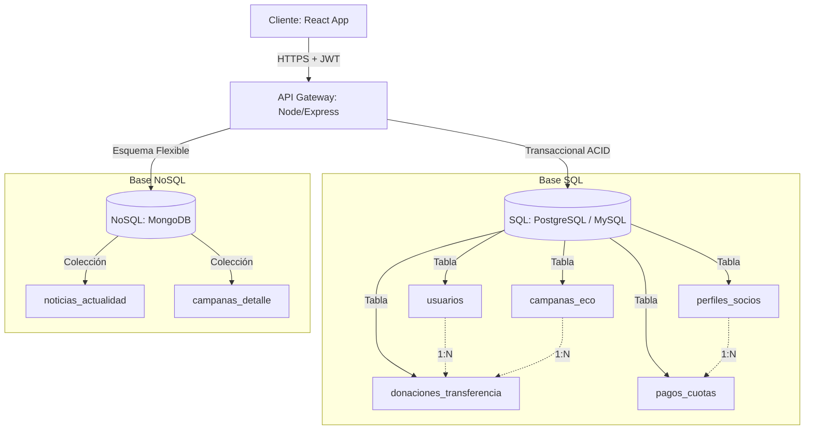

# Reporte de Auditoría y Recomendaciones de Documentación

Este reporte analiza el estado actual del archivo [README.md](file:///Users/aramisprieto/Documents/cooperadora-hospital1/README.md) comparado con la estructura real de carpetas (`frontend/` y `backend/`) y los últimos 10 commits de Git. Identifica discrepancias y brinda un plan de mejoras para alinear la documentación con el código.

---

## 🔍 Hallazgos Principales

1. **Enlaces Absolutos de Desarrollador** – Rutas locales (`file:///c:/Users/...`) rotas para otros colaboradores.
2. **`package-lock.json` Persistentes** – Aún existen en `frontend/` y `backend/` pese a que el changelog indica su eliminación.
3. **Modelo de Base de Datos Incompleto** – Falta documentación de `DonacionTransferencia` y `PagoCuota` en el diagrama Mermaid.
4. **Mapa de Rutas del Frontend Ausente** – No se describen las URL SPA (`/campanas`, `/noticias/:id`, etc.).
5. **Detalles de Seguridad del Webhook** – No se explica la verificación HMAC‑SHA256 y mitigación de replay attacks.

---

## 📋 Recomendaciones Técnicas

### 1. Añadir Sección "Estructura del Proyecto"
```markdown
## 📂 Estructura del Proyecto
...
```
*(se incluye árbol de carpetas como en el reporte anterior)*

### 2. Actualizar Diagrama Mermaid con Nuevas Tablas


### 3. Documentar Rutas SPA del Frontend
| Ruta | Vista | Acceso | Descripción |
|---|---|---|---|
| `/` | `Home.jsx` | Público | Carrusel de campañas activas. |
| `/campanas` | `CampaignSearch.jsx` | Público | Buscador y filtros con paginación. |
| `/campanas/:id` | `CampaignDetail.jsx` | Público | Detalle premium + botón Mercado Pago. |
| `/noticias` | `NewsSearch.jsx` | Público | Lista y ordenamiento de noticias. |
| `/noticias/:id` | `NewsDetail.jsx` | Público | Vista detallada con breadcrumbs. |
| `/login` | `Login.jsx` | Público | Formulario de autenticación. |
| `/admin` | `AdminPanel.jsx` | Administrador | Panel de control y métricas. |
| `/socio` | `SocioPanel.jsx` | Socio | Historial de cuotas y donaciones. |

### 4. Explicar Verificación HMAC del Webhook
```markdown
### 🛡️ Verificación Criptográfica de Webhooks (Mercado Pago)
1. **Extracción de firma** del header `x‑signature` (campos `ts` y `v1`).
2. **Cálculo**: `HMAC‑SHA256(manifest, MP_WEBHOOK_SECRET)` donde `manifest = "id:${dataId};request-id:${requestIdHeader};ts:${ts};"`.
3. **Replay‑Attack**: se rechaza si `|now - ts| > 5 min`.
4. **Fail‑Closed**: sin `MP_WEBHOOK_SECRET` se responde 500; para pruebas `BYPASS_WEBHOOK_SIGNATURE` permite bypass.
```

### 5. Documentar Optimización de Bundle y Caché Selectiva
* **Code Splitting** con `manualChunks` (Recharts → `charts`, Lucide → `icons`).
* **Caché Selectiva**: `flushCachePattern(pattern)` invalida solo claves con prefijo, evitando vaciar toda la caché.

### 6. Depurar Enlaces y Limpiar Repositorio
* Reemplazar rutas locales por rutas relativas (`frontend/src/views/...`).
* Eliminar `frontend/package-lock.json` y `backend/package-lock.json` para que solo `pnpm-lock.yaml` gestione dependencias.

---

Con estos cambios la documentación quedará alineada con el estado actual del código, facilitando onboarding y mantenibilidad.
